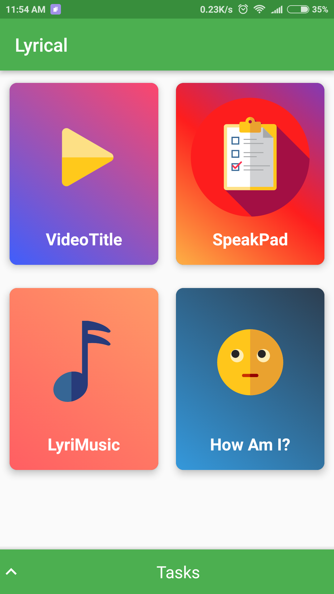

# Lyrical
# API Name: HavenOnDemand SpeeechRecognizer.

 

#  Features:

<strong>Video Subtitles:</strong> Generate video subtitles.

<strong>Audio Subtitles:</strong> Generate audio lyrics.

<strong>SpeakPad:</strong> Bored of typing?? Speak it and copy text.

<strong>How am I?:</strong> Tell me about yourself and I will tell are you how postive person you are.(TODO: Currently it only display sentiment i.e postive, negative, neutral. A sentence can be generated based on fetched sentiment texts.)

# API key is removed.

<strong>Note:</strong> The converted text results are not state of art as per what I have seen so far mainly with music files.
The above mentioned features are implemented mostly to demonstrate usage of speechRecognization API.
